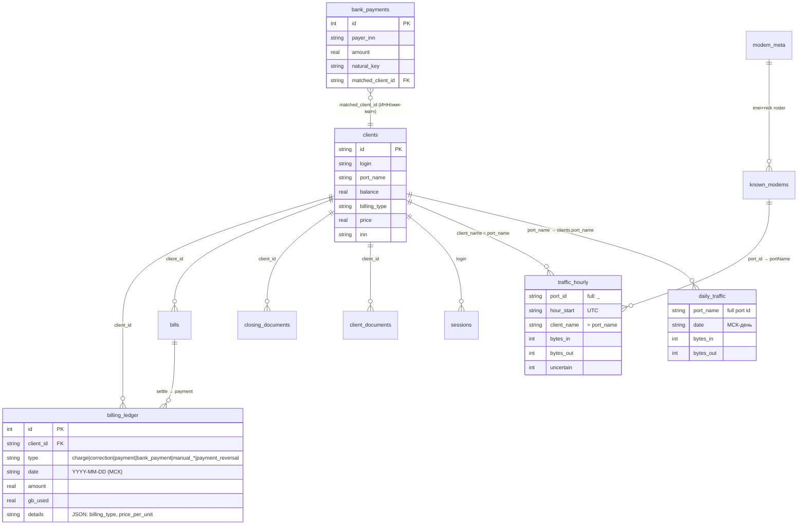

# DATA-MODEL — глоссарий идентификаторов, ER, матрица источников трафика (D9)

## Глоссарий идентификаторов

| Термин | Что это | Где живёт / пример |
|---|---|---|
| `port_id` | ID прокси-порта на боксе, присвоенный ProxySmart. Локален для бокса; глобально уникален только как `<server>_<port_id>` («full port id», `S2_portQcSp2e0Y`). | Ключи `bandwidth_report_all`, `ports[].portID`, `traffic_hourly.port_id` (хранит full id) |
| `port_key` | То же, что full port id: `<server>_<port_id>`. Ключ маппинга `portKeyToPortName` (server.js:1126+) и `known_modems[server][port_id]`. | server.js portKeyToPortName, daily_traffic.port_name (см. ниже — там это full id) |
| `portName` | Человекочитаемое имя порта = привязка к клиенту. У клиента поле `clients.port_name`; в bw-ответе — `portName`. Один клиент ↔ один portName; модемов у клиента может быть несколько (несколько портов с одним portName). | clients.port_name, bw[].portName, traffic_hourly.client_name |
| `IMEI` | Аппаратный идентификатор модема (строка 15 цифр). Ключ модема внутри сервера; глобальный ключ — `<server>|<imei>` (fleet) или `<server>_<imei>` (uptimeTracking). | modem_details.IMEI, modem_meta.imei, known_modems |
| `nick` | Человекочитаемое имя модема (NICK на боксе, напр. `RO_1`). Не стабилен при глитче (модем может стать `random####` — такие исключаются из fleet). | modem_details.NICK, modem_meta.nick |
| `login` | Логин учётной записи дашборда (клиентской или админской). `clients.login` → sessions.login; портал авторизует по нему + port_name_filter. Также `LOGIN` в записи порта — логин прокси-доступа (не путать!). | clients.login, sessions; ports[].LOGIN |
| `operator_packages` | JSON-настройка пакетов: `operator`, `type`, `volume_gb`, `max_sims`, `price`, `currency`, пороги. Число SIM не хранится вручную: это distinct активные ICCID (fallback server+IMEI/nick) из `modem_meta`, без soft-deleted. | `kv_store.app_settings`; расчёт в `src/billing/operator-package-costs.js` |

Цепочка привязки трафика к клиенту:
`traffic_hourly.port_id` (full) → `known_modems[server][port_id]` (port_key) →
`.portName` → `clients.port_name` (→ `client_name` денормализован в
traffic_hourly/daily_traffic при записи).

## ER-диаграмма (деньги и трафик)

## Матрица «источник трафика → потребитель»

| Источник | Природа | Потребители (по факту кода) |
|---|---|---|
| `hourly_snapshots` | Последние сырые счётчики боксов (дельта-база) | **только HourlyAgg** (src/traffic/hourly.js) ✓ |
| `traffic_hourly` | Почасовые дельты, UTC, канон | биллинг (durable-путь), акты/сверка (MonthlyReconciliation, balance/акты через ledger, записанный из него), daily_summary, аналитика (src/db/analytics.js), ownership, портал (только «последний час», client-portal.js:107+) |
| `daily_traffic` | Суточные MAX-счётчики, МСК-день | durable-фолбэк биллинга (billing.js, shadow-billing.js), портал/аналитика (analytics.js:338+), ops-ext, billing-ext, servers |
| live (ProxySmart bw-ответ) | Текущие счётчики в памяти/кэше | UI дашборда, портал (`liveMonthGb`), live-фолбэк биллинга при hours_present < 20 и legacy V1 max(durable, live) до Фазы 2 (billing.js), shadow-лог gb_live |

Расхождений с заявленной матрицей не найдено: читатели соответствуют
назначению источников (проверено grep по `FROM traffic_hourly` /
`daily_traffic` / `hourly_snapshots`, 2026-08).

## Инвариант «портал == акт»

Портал (`GET /api/dashboard_data` → `billing.monthExpense`, client-portal.js)
и акты (`buildActItemsFromLedger`, src/tochka/documents.js) читают **один
источник — billing_ledger** (charge + correction за период):
портал — через `ledgerExpense` (server.js:431), акт — суммой `cost` списаний
+ signed-корректировки. Инвариант залочен тестом
`tests/portal-act-parity.test.js` (Σ ledgerExpense == totalCost акта в
допуске 0.02 ₽).

Известная оговорка: у legacy-строк charge с `cost = 0`, но `amount > 0`
портал учитывает amount, акт — нет (новые строки всегда пишут cost).
Трафик «месяц live» (liveMonthGb) — отдельный показатель из live-счётчиков,
с актом по определению не сравнивается; билled-ГБ портала (billedMonthGb) —
тоже из ledger (delta_gb), как quantity акта.
